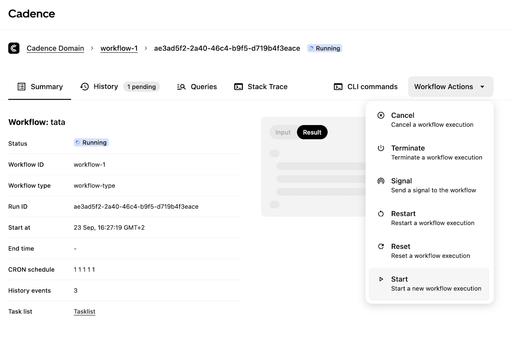
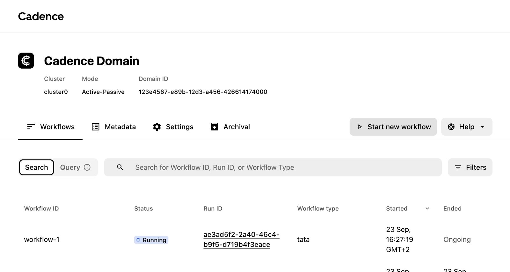

For a long time, controlling Cadence workflows was primarily done through the client SDKs or the administrative CLI. Our vision for **Cadence Web** has been to evolve it from a read-only inspection tool into a **Unified Operational Hub** for all workflow management needs. This means putting every essential workflow action directly in the hands of operators, support engineers, and developers—right where they observe workflows.

Over the past releases, we’ve been steadily introducing interactive capabilities such as **Terminate**, **Cancel**, **Restart**, **Signal**, and **Reset**. Each of these brought Cadence Web closer to becoming a full-featured operational console.

Today, we’re completing that journey with the introduction of the **`Start Workflow`** action. Operators can now manage the full workflow lifecycle—from initiation to completion—entirely within the Web UI.

***

## Where to Find the New Controls

All workflow actions are designed to be discoverable and intuitive, fitting naturally into existing pages and workflows.

#### 1. Workflow Execution Page

#### 2. Domain Page (Starting New Workflows)

***

##  Try It Today!

With **Start Workflow** now available, Cadence Web provides a truly end-to-end operational surface for workflows. Whether you're debugging incidents, restarting workflows after a fix, or manually kicking off test runs, everything you need is now in one place.

If you haven’t updated yet, we highly recommend upgrading to the latest Cadence Web release and exploring the new Workflow Actions.
